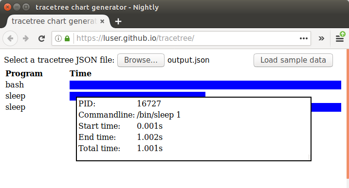

  

tracetree
=========
Run a process, ptrace'ing it and all of its children, and print the entire process tree at the end.

Currently only Linux support is implemented.

Examples
========

Print a process tree in text format to stdout:

    $ tracetree /bin/bash -c '/bin/sleep 1; /bin/sleep 1'
    16665 bash -c /bin/sleep 1; /bin/sleep 1 [2.004s]
    	16666 sleep 1 [1.001s]
    	16667 sleep 1 [1.000s]

Print a process tree in JSON format to `output.json`:

    $ tracetree -f json -o output.json /bin/bash -c '/bin/sleep 1; /bin/sleep 1'
    $ python -mjson.tool output.json
    {
        "children": [
            {
                "children": [],
                "cmdline": [
                    "/bin/sleep",
                    "1"
                ],
                "ended": "2017-06-22T06:28:58.960384212-04:00",
                "pid": 16727,
                "started": "2017-06-22T06:28:57.959636824-04:00"
            },
            {
                "children": [],
                "cmdline": [
                    "/bin/sleep",
                    "1"
                ],
                "ended": "2017-06-22T06:28:59.961990469-04:00",
                "pid": 16728,
                "started": "2017-06-22T06:28:58.960849779-04:00"
            }
        ],
        "cmdline": [
            "/bin/bash",
            "-c",
            "/bin/sleep 1; /bin/sleep 1"
        ],
        "ended": "2017-06-22T06:28:59.962407641-04:00",
        "pid": 16726,
        "started": "2017-06-22T06:28:57.958836370-04:00"
    }

JSON output can be viewed with this [web visualizer](https://luser.github.io/tracetree/):

